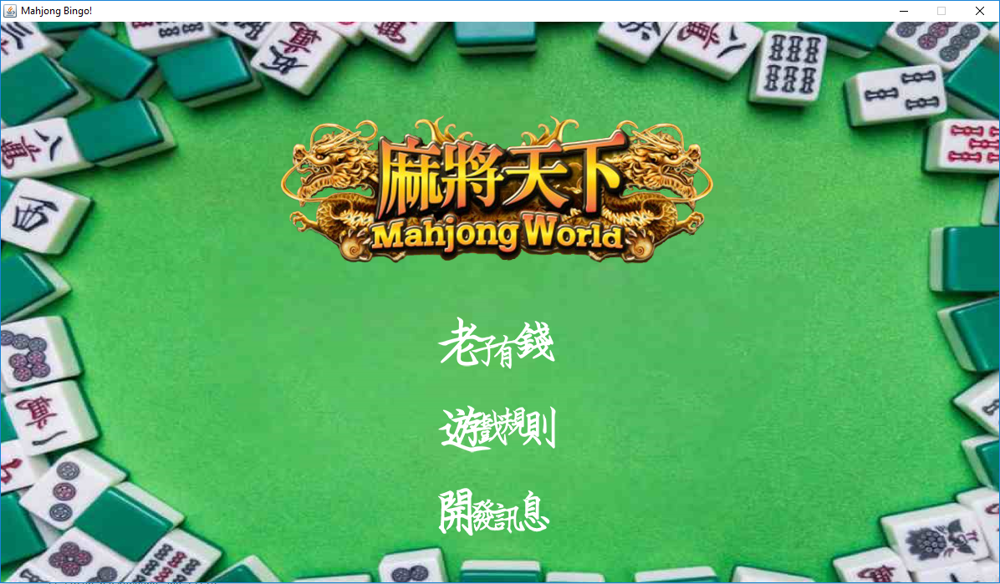
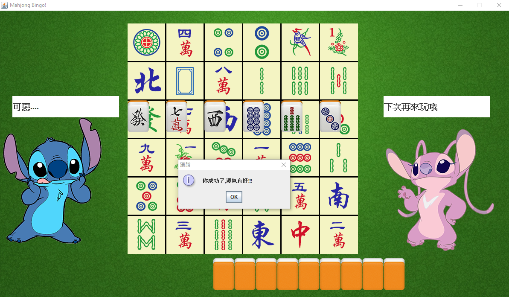
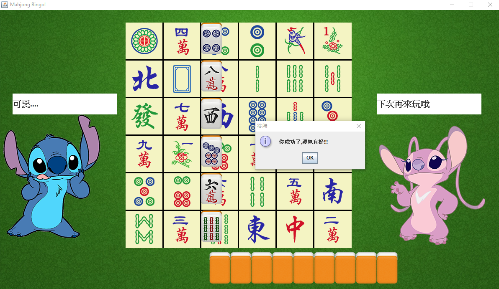
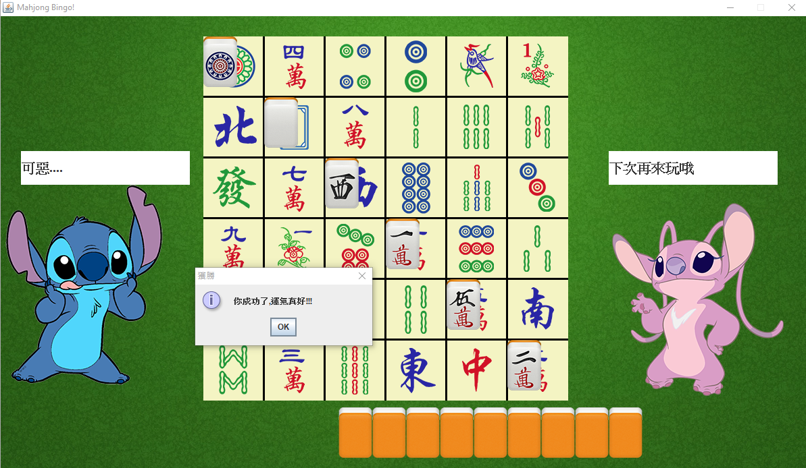

## Mahjong-Bingo: A Bingo game in Taiwan Night Market

This project is co-developed by Ken, Kevin and Martin. 

To start the game, you can simply open the Mahjong-Bingo.jar. Then, you should be able to see the following page:

Table of Content:
- Motivation - Why Mahjong-Bingo
- Introduction - How to play
- Future Improvement
- Acknowledgements

### Motivation - Why Mahjong-Bingo

We were exchanging students visiting National Cheng Kung University (or simply NCKU) during Summer Semister in 2018. Our team was attending a JAVA programming course and was required to complete a project using JAVA programming. 

In a visit to Tainan night market, we observed citizens playing this gmae. We had a deep impression towards this interesting game since we saw no one won any prizes and thus aroused our interest to study this game.

### Introduction - How to play

This is the game flow:
1. Draw 15 face-down Mahjong tiles
2. Click to reveal the tiles
3. Drag the tiles to the correspondent place which shares the same picture
4. If any six of the tiles complete a line (no matter it is **horizontal, vertical and diagonal**), you win
5. If there are five tiles connected while no line is completed, get extra 3 tiles and continue the game
6. You lose when you have no tiles and no line is completed

Winning Conditions:

### Future Improvement

1. We are looking for some no copyright music and sound effect which fit the style of the game
2. ~We keen to find some picutre of hot ladies to replace the two stitches~

### Acknowledgements

Many thanks to the painter Martin Perrson for publishing these tile pictures. Those tiles can be obtained via this link: http://www.martinpersson.org/wordpress/2010/10/free-mahjong-icons/

For other pictures, our team does not own any rights. We obtained those photos from the internet and the usage is totally based on educational purpose. If this violates anyone's rights, we would delete those involved pictures ASAP.
